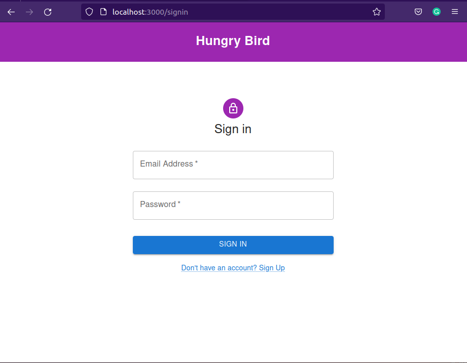
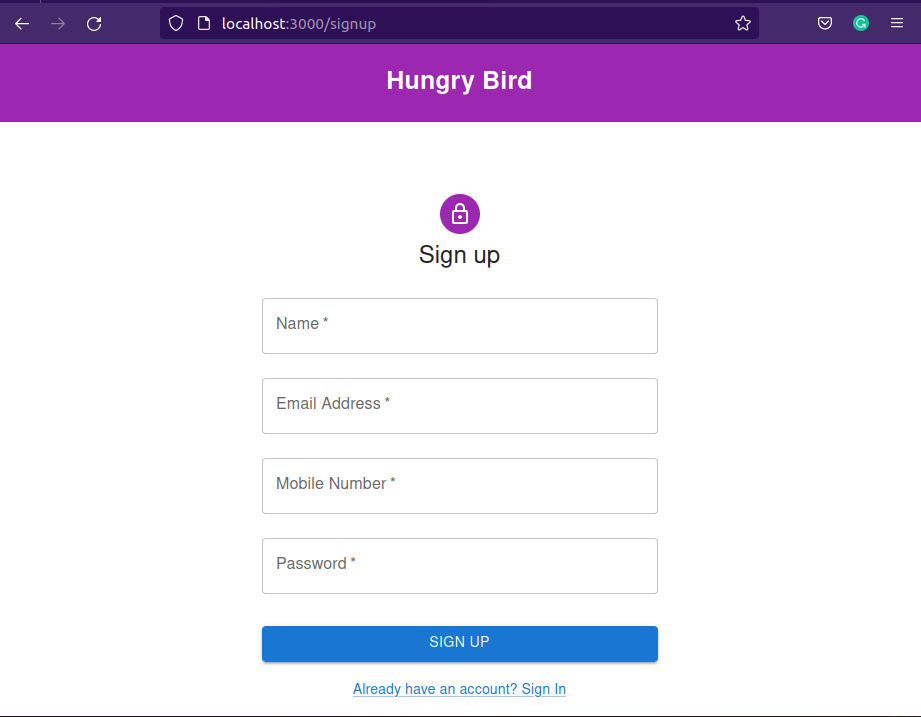

# HUNGRY BIRD
 
HUNGRY BIRD is a website for people of IIT Bhubaneswar to order food from the food stalls available in the campus. 
The tech stack used was 
1. ExpressJS (A Node.js framework for writing server side code) 
2. ReactJS (For frontend) 
3. OracleDB (Database to store and retrieve data) 

